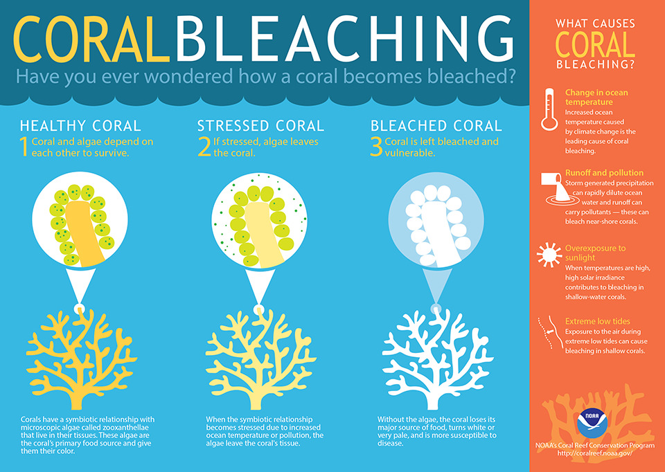

# **Coral Bleaching**

## **What is coral bleaching?**
#### Coral bleaching is the loss in pigmentation of the coral plant, leading coral plants susceptible to disease.
#### When coral bleaching occurs, the coral may survive but is placed under more stress leading to reduced survivability.

#### The following picture supplied by the National Oceanic and Atmospheric Administration demostrates the situation:

### **At what rate have algae and bacteria levels been dropping, at what rate has coral bleaching been rising, and what is the expected outlook for both?**
### **Where in the world are coral reefs most affected, and why is this the case?**

#### Due to coral's symbiotic relationship with algae, these rise in temperatures have led to an increase in coral bleaching around the world. The most prominent regions affected by coral bleaching include reefs in the Indian ocean and Oceanic areas. The data displayed is from 2010:

#### As global temperatures are expected to continue rising, the severity of coral bleaching is also expected to rise.  Without any intervention, coral reefs will become more susceptible to disease.  However, conservation efforts are effective reducing the impact of diseases at target sites.  The spread of the Black-Band Disease in the Caribbean has seen major reduction in the past 20 years:

